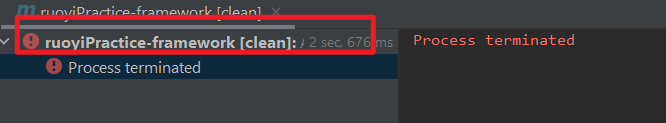

# 个人练习仓库

记录练习记录 和 工作用用到的技术的笔记。

# 常用依赖

## spring 都有哪些包

[api 文档中可以看到有哪些包](https://docs.spring.io/spring-framework/docs/5.3.31/javadoc-api/)

另外的参考：[参考](https://blog.csdn.net/dongyang2019/article/details/113726740)

## 个人常用依赖的版本

本人使用的依赖的版本都是 `spring-boot-dependencies 2.7.18` 中的版本。

```xml
<!-- 版本汇总 -->
<spring-context.version>5.3.31</spring-context.version>
<jakarta-annotation.version>1.3.5</jakarta-annotation.version> <!-- @Resource 是 java 原生的注解。在这个包 -->
<lombok.version>1.18.30</lombok.version>
<junit.version>4.13.2</junit.version>
<aspectj.version>1.9.7</aspectj.version>
```

### spring 相关依赖

```xml
<!-- spring context 依赖：普通java工程使用spring框架只需引入这一个就够了 -->
<dependency>
    <groupId>org.springframework</groupId>
    <artifactId>spring-context</artifactId>
    <version>${spring-context.version}</version>
</dependency>

<dependency>
    <groupId>jakarta.annotation</groupId>
    <artifactId>jakarta.annotation-api</artifactId>
    <version>${jakarta-annotation.version}</version>
</dependency>
<!-- spring aop 依赖：spring-context里面没有这个，要用 aop 的时候要加上 -->
<dependency>
   <groupId>org.aspectj</groupId>
   <artifactId>aspectjweaver</artifactId>
   <version>${aspectj.version}</version>
</dependency>

<!-- springmvc 依赖 -->
<dependency>
    <groupId>org.springframework</groupId>
    <artifactId>spring-webmvc</artifactId>
    <version>${spring-context.version}</version>
</dependency>

<dependency>
    <groupId>org.apache.commons</groupId>
    <artifactId>commons-dbcp2</artifactId>
    <version>2.12.0</version>
</dependency>
```

### 其他依赖

```xml
<!-- lombok 依赖  -->
<dependency>
    <groupId>org.projectlombok</groupId>
    <artifactId>lombok</artifactId>
    <version>${lombok.version}</version>
</dependency>

<!-- junit 框架 -->
<dependency>
    <groupId>junit</groupId>
    <artifactId>junit</artifactId>
    <version>${junit.version}</version>
</dependency>
```

### exclusions 排除依赖

因为 spring-core 依赖了 commons-logging，而其他模块都依赖了 spring-core，所以整个 spring 框架都依赖了 commons-logging，如果有自己的日志实现如 log4j，可以排除对 commons-logging 的依赖，没有日志实现而排除了 commons-logging 依赖，编译报错。

### 使用 maven 时遇到的问题

1. maven process terminate

    点下图那里可以查看详细报错

    

2. 子工程最好不要定义 groupId 和 version

    子工程自动继承父工程的 groupId 和 version

3. 使用 dependencies 管理项目依赖的版本时， maven project 出现你要导入的内容

    对每个子模块用一下 clean ，看看哪里有报错，解决报错，即可

    > 多模块工程的 maven，在任何一个子模块出错了，整个工程的依赖都导不到

4. `classpath*:mapper/**/*Mapper.xml`

    - `*` 通配符用于匹配当前目录下的任意文件或目录，但不包括子目录中的内容。
    - `**` 通配符用于匹配任意层级的目录。这意味着它可以匹配当前目录及其所有子目录中的文件。
    - `classpath*`: 这个前缀表示不仅匹配当前类路径下的资源，还会匹配所有的类路径，包括所有的 JAR 文件和其他类路径中的资源。

5. [WARNING] The POM for xxx is missing, no dependency inform

    从最顶级的父模块开始 install，全部重新 install 之后就行了

# xml 文件模板

1. 最基础的 `bean.xml`

    ```xml
    <?xml version="1.0" encoding="UTF-8"?>
    <beans xmlns="http://www.springframework.org/schema/beans"
        xmlns:xsi="http://www.w3.org/2001/XMLSchema-instance"
        xsi:schemaLocation="http://www.springframework.org/schema/beans
            https://www.springframework.org/schema/beans/spring-beans.xsd">

    </beans>
    ```

2. Annotation-based Container Configuration

    ```xml
    <?xml version="1.0" encoding="UTF-8"?>
    <beans xmlns="http://www.springframework.org/schema/beans"
        xmlns:xsi="http://www.w3.org/2001/XMLSchema-instance"
        xmlns:context="http://www.springframework.org/schema/context"
        xsi:schemaLocation="http://www.springframework.org/schema/beans
            https://www.springframework.org/schema/beans/spring-beans.xsd
            http://www.springframework.org/schema/context
            https://www.springframework.org/schema/context/spring-context.xsd">

        <context:annotation-config/>

    </beans>
    ```

3. AOP

    ```xml
    <?xml version="1.0" encoding="UTF-8"?>
    <beans xmlns="http://www.springframework.org/schema/beans"
        xmlns:xsi="http://www.w3.org/2001/XMLSchema-instance"
        xmlns:context="http://www.springframework.org/schema/context"
        xmlns:aop="http://www.springframework.org/schema/aop"
        xsi:schemaLocation="http://www.springframework.org/schema/beans
            https://www.springframework.org/schema/beans/spring-beans.xsd
            http://www.springframework.org/schema/context
            https://www.springframework.org/schema/context/spring-context.xsd
            http://www.springframework.org/schema/aop
            http://www.springframework.org/schema/aop/spring-aop.xsd">

    </beans>
    ```

# Server Sent Event

## 原理

## 使用

## 注意事项

- 在结合 SpringBoot 进行 web 开发时，首先前端需要向后端请求生成 SSE 对象，生成之后，当后端向前端发送消息时，消息的内容会显示在创建对象的那个接口里面显示

# 其他

1. Lombok 导致 spring bean 的 `scopt=prototype` 设置不生效

    使用了 `@Data` 之后导致 `scopt=prototype` 设置不生效，而 lombok 中的其他注解则不会。

    另外请参见：[参考](https://wenku.csdn.net/answer/896aff3cc29f48b38c4fb2faf301b2b7)
